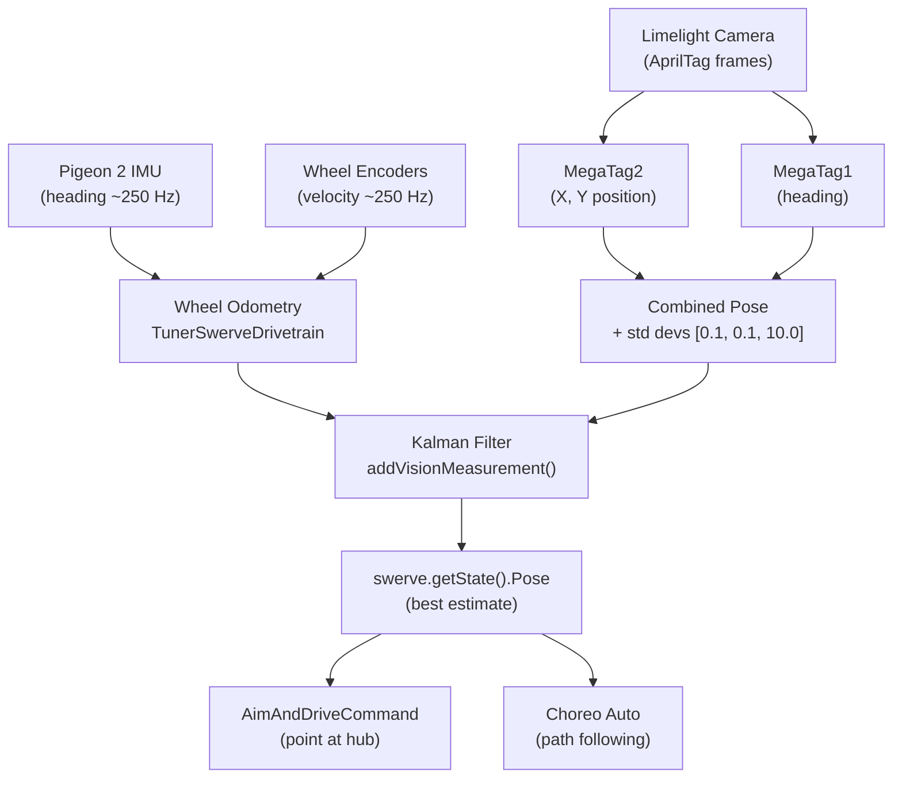

# Overview

Wayne HS 10411 Rufus 

[Google Doc Notes](https://docs.google.com/document/d/1e-II6_diUCd73_c5pIJWgDAT_IvrZXD0227dueINiO4/edit) <-- Log what you do here

# 2026CompetitiveConcept

This repository contains the code used for the WestCoast Products 2026 [Competitive Concept](https://wcproducts.com/pages/wcp-competitive-concepts).

The project is based on one of CTRE's [Phoenix 6 example projects](https://github.com/CrossTheRoadElec/Phoenix6-Examples/tree/main/java/SwerveWithChoreo). It uses WPILib [command-based programming](https://docs.wpilib.org/en/stable/docs/software/commandbased/what-is-command-based.html) to manage robot subsystems and actions, a [Limelight](https://limelightvision.io/) for vision, and [Choreo](https://choreo.autos/) for autonomous path following.

## Driver Controls (Xbox Controller — port 0)

### Driving
| Input | Action |
|---|---|
| Left Stick | Translate (field-centric) |
| Right Stick X | Rotate |
| A | Lock heading toward opponent alliance wall (180°) |
| B | Lock heading right (90° clockwise) |
| X | Lock heading left (90° counter-clockwise) |
| Y | Lock heading toward own alliance wall (0°) |
| Back | Re-zero field-centric orientation to current robot heading |

### Shooting
| Input | Action |
|---|---|
| Right Trigger | Auto-aim at hub using Limelight, spin up shooter, feed when aimed and ready |
| Right Bumper | Spin up shooter to dashboard RPM (default 5000), feed once above 3500 RPM |

> **Right Trigger vs Right Bumper:** Right trigger requires a valid Limelight target lock before feeding. Right bumper shoots without vision — use this when the Limelight has no target or for close shots.

### Intake
| Input | Action |
|---|---|
| Left Trigger | Deploy intake pivot and run rollers (hold to intake) |
| Left Bumper | Stow intake pivot |

### Climbing
| Input | Action |
|---|---|
| D-Pad Up | Raise hanger to pre-hang position |
| D-Pad Down | Pull hanger down to fully climbed position |

### Troubleshooting
| Input | Action |
|---|---|
| D-Pad Left | Reverse floor and shooter to clear a jam (hold) |

---

## Field Setup & Match Calibration

Complete these steps **at every new event** (and after any camera or robot mechanical changes) before going on the field.

### 1. Upload the AprilTag Field Map to the Limelight

> Do this once per event — not before every match.

1. Connect a laptop to the robot's network (robot on, roboRIO booted).
2. Open the Limelight web UI: **http://limelight.local:5801** (or **http://10.104.11.11:5801** if mDNS isn't working).
3. Go to **Settings → AprilTag Field Map**.
4. Upload the correct JSON from the [`limelight-config/`](limelight-config/) folder:
   - **Most events (district, regional):** `2026-rebuilt-welded.json`
   - **If the event specifies AndyMark field parts:** `2026-rebuilt-andymark.json`
5. Confirm the active pipeline is set to **AprilTag** mode.

### 2. Verify Camera Pose (Robot-to-Camera Transform)

The Limelight needs to know where it is mounted on the robot to produce accurate field-relative pose estimates.

1. In the Limelight web UI, go to **Settings → Robot Offset** (or the 3D tab depending on firmware version).
2. Enter the camera's position and angle relative to the center of the robot:
   - **Forward (X):** distance the camera is in front of robot center (meters, positive = forward)
   - **Side (Y):** distance left/right of robot center (meters, positive = left)
   - **Up (Z):** height above the floor (meters)
   - **Roll / Pitch / Yaw:** camera tilt angles (degrees)
3. Measure these from the robot physically if they haven't been set — they must match the actual mount.

### 3. Re-Zero Field-Centric Orientation Before Each Match

At the start of every match (robot placed on the field):

1. Point the **front of the robot** toward the driver station wall (or align as required by your starting position).
2. Press **Back** on the Xbox controller to re-zero field-centric orientation to the robot's current heading.

> The robot uses field-centric driving relative to this zero, so this must match how the robot is physically placed.

### 4. Verify Vision Is Working (Pre-Match Check)

1. Open **Shuffleboard** or **AdvantageScope** while connected to the robot.
2. Confirm the **"Estimated Robot Pose"** value under `SmartDashboard/limelight` is updating and makes sense given the robot's position on the field.
3. If the pose is wildly wrong or not updating:
   - Check that the Limelight has a tag in view (run a test with tags visible).
   - Re-confirm the field map was uploaded and the correct pipeline is active.
   - Check that the camera pose offset is configured correctly.

### 5. Shooter Tuning (If Needed)

- The target shooter RPM for manual shots (Right Bumper) is set via **Shuffleboard** — look for the `Target RPM` slider under the Shooter subsystem widget.
- Default is **5000 RPM**. Adjust based on shot distance for the event venue.
- Feed threshold is fixed at **3500 RPM** — the floor and feeder will not run until the shooter crosses this.

---

## Power-Up Initialization

When the robot is powered on and robot code starts, several automatic initialization steps occur before the robot is ready to operate. Understanding this sequence helps diagnose issues and know what to expect when enabling the robot.

> **If you change any of this behavior in code, update this section.**
> Links back here are in the relevant source files:
> - `RobotContainer.java` — `configureBindings()` (homing trigger)
> - `Intake.java` — `homingCommand()`
> - `Hanger.java` — `homingCommand()`

### 1. On Code Start (Robot Constructor)

These happen immediately when the robot code launches, before any mode is active:

| What | Detail |
|---|---|
| AdvantageKit logging | Starts writing `.wpilog` to `/home/lvuser/logs/` and publishing live via NT4 |
| Brownout protection | RoboRIO brownout threshold set to **6.1 V** |
| Subsystems initialized | All subsystems (Swerve, Intake, Floor, Feeder, Shooter, Hood, Hanger, Limelight) are instantiated and their motors configured |
| Vision update begins | Limelight default command starts running immediately, even while disabled (`ignoringDisable = true`) |
| Shooter default command | Shooter default is `stop()` — motors hold at zero until commanded |

### 2. On First Enable (Teleop or Autonomous — not Test Mode)

When the robot transitions into **teleop or autonomous** for the first time after power-up, two homing sequences run automatically and in parallel. They are suppressed in **test mode**.

#### Intake Pivot Homing

The intake pivot motor has no absolute encoder, so its zero position must be found by driving it to a physical hard stop.

1. Pivot motor drives **outward at 10% output** (toward the hard stop).
2. Code waits until **supply current exceeds 6 A** — this indicates the pivot has stalled against the hard stop.
3. Encoder is **zeroed** at the hard stop position (`HOMED` = 110°).
4. Pivot immediately moves to **`STOWED` position (100°)**.

> This command uses `kCancelIncoming` — it cannot be interrupted once started. A subsequent position command will be queued until homing finishes.

#### Hanger Homing

The hanger motor also uses a hard-stop current-sensing approach.

1. Hanger motor drives **inward (retract) at −5% output**.
2. Code waits until **supply current exceeds 0.4 A** — indicating the hanger has bottomed out.
3. Encoder is **zeroed** at the retracted position (`HOMED` = 0 inches extension).
4. Hanger immediately extends to the **`EXTEND_HOPPER` position (2 inches)** — clear of the robot chassis.

> This command uses `kCancelSelf` — any position command issued during homing will cancel the homing sequence.

### 3. Field-Centric Drive Zero

The swerve drive uses field-centric control relative to a stored heading. This heading is **not automatically reset on power-up** — it must be manually re-zeroed by the driver before each match using the **Back button** on the Xbox controller (see [Re-Zero Field-Centric Orientation](#3-re-zero-field-centric-orientation-before-each-match)).

> `seedFieldCentric()` is suppressed in test mode to avoid affecting other test sequences.
---

## How the Robot Knows Its Position on the Field

Rufus maintains a continuous field-relative pose (X, Y, heading) by fusing two sources: **wheel odometry** and **Limelight vision**. These are merged via a Kalman filter built into CTRE's `SwerveDrivetrain` base class.

### 1. Wheel Odometry (always running)

The CTRE [`TunerSwerveDrivetrain`](src/main/java/frc/robot/generated/TunerConstants.java) tracks the robot's position by integrating wheel encoder velocities and gyroscope (Pigeon 2 IMU) heading at a high rate (~250 Hz). This is reliable over short distances but accumulates drift over time.

The current estimated pose is available at any time via `swerve.getState().Pose`. It is used throughout the robot — for example, [`AimAndDriveCommand`](src/main/java/frc/robot/commands/AimAndDriveCommand.java) uses it to compute the angle from the robot to the hub on every cycle.

### 2. Limelight AprilTag Vision (fused continuously)

The [`Limelight`](src/main/java/frc/robot/subsystems/Limelight.java) subsystem reads AprilTag detections from the camera and returns a field-relative pose estimate using **MegaTag2** (position) and **MegaTag1** (heading):

| Source | Used for | Why |
|---|---|---|
| MegaTag2 | X / Y translation | More position-stable; uses IMU heading to resolve tag ambiguity |
| MegaTag1 | Rotation (heading) | Helps counteract IMU drift over a match |

The combined pose is published to `SmartDashboard/limelight/Estimated Robot Pose` every cycle for diagnostics in Shuffleboard or AdvantageScope.

Standard deviations passed with each vision measurement are `[0.1 m, 0.1 m, 10.0 rad]` — the filter trusts X/Y position strongly but is skeptical of heading from vision, since the gyro is generally more reliable for rotation.

### 3. Kalman Filter Fusion

[`RobotContainer.updateVisionCommand()`](src/main/java/frc/robot/RobotContainer.java#L141) runs as the Limelight's default command on **every periodic cycle, even while disabled** (`ignoringDisable = true`). Each cycle it:

1. Gets the current best pose from the swerve state.
2. Sends it to the Limelight (so MegaTag2 can use the IMU heading for tag disambiguation).
3. If a valid pose estimate is returned (at least one tag visible), calls [`swerve.addVisionMeasurement()`](src/main/java/frc/robot/subsystems/Swerve.java#L149) to feed the fix into the Kalman filter with its standard deviations.

The filter automatically weights odometry vs. vision based on the respective standard deviations. If no tags are visible, the robot continues relying on odometry alone.

### 4. How It Is Used

- **Auto-aim ([`AimAndDriveCommand`](src/main/java/frc/robot/commands/AimAndDriveCommand.java)):** Computes the direction from `swerve.getState().Pose` to `Landmarks.hubPosition()` and rotates the robot to point its shooter at the hub.
- **Autonomous ([`AutoRoutines`](src/main/java/frc/robot/commands/AutoRoutines.java)):** Choreo path following uses the fused pose to run PID corrections in [`Swerve.followPath()`](src/main/java/frc/robot/subsystems/Swerve.java#L98), keeping the robot on the planned trajectory.
- **Diagnostics:** The live estimated pose is visible in AdvantageScope and Shuffleboard whenever the Limelight has tags in view.

